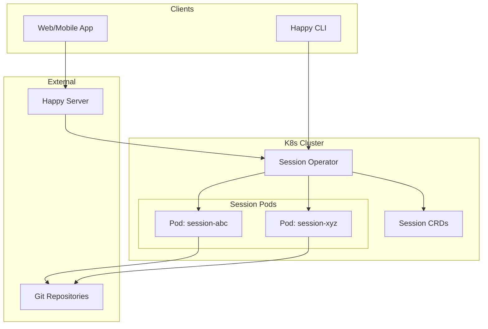
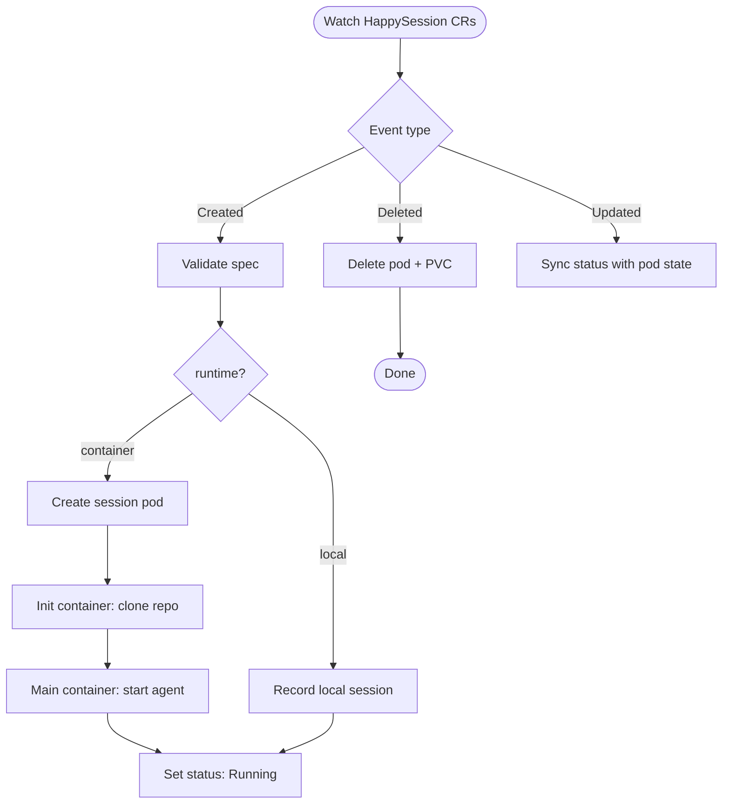
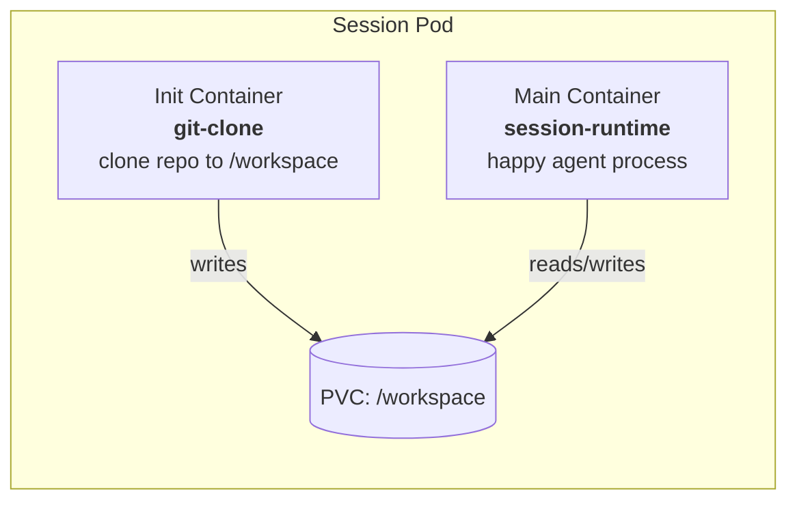
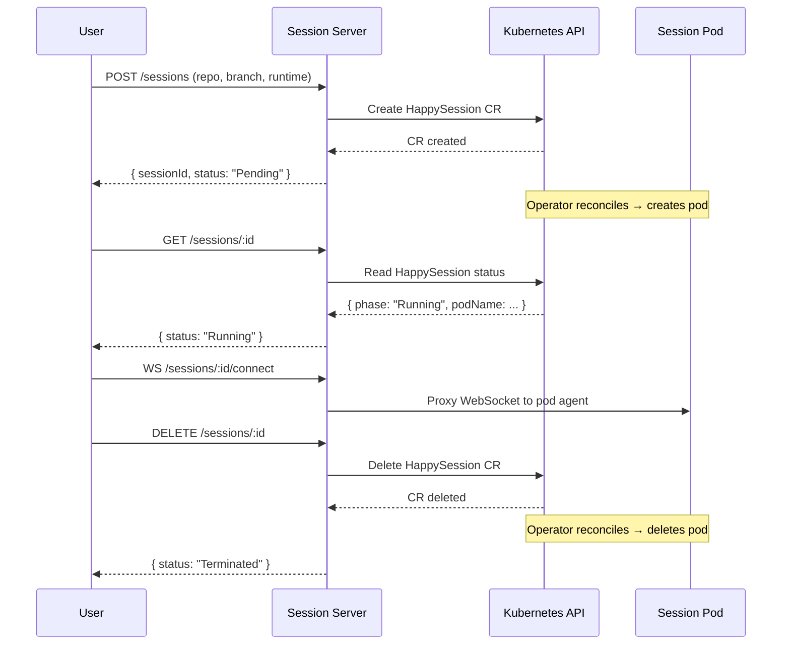
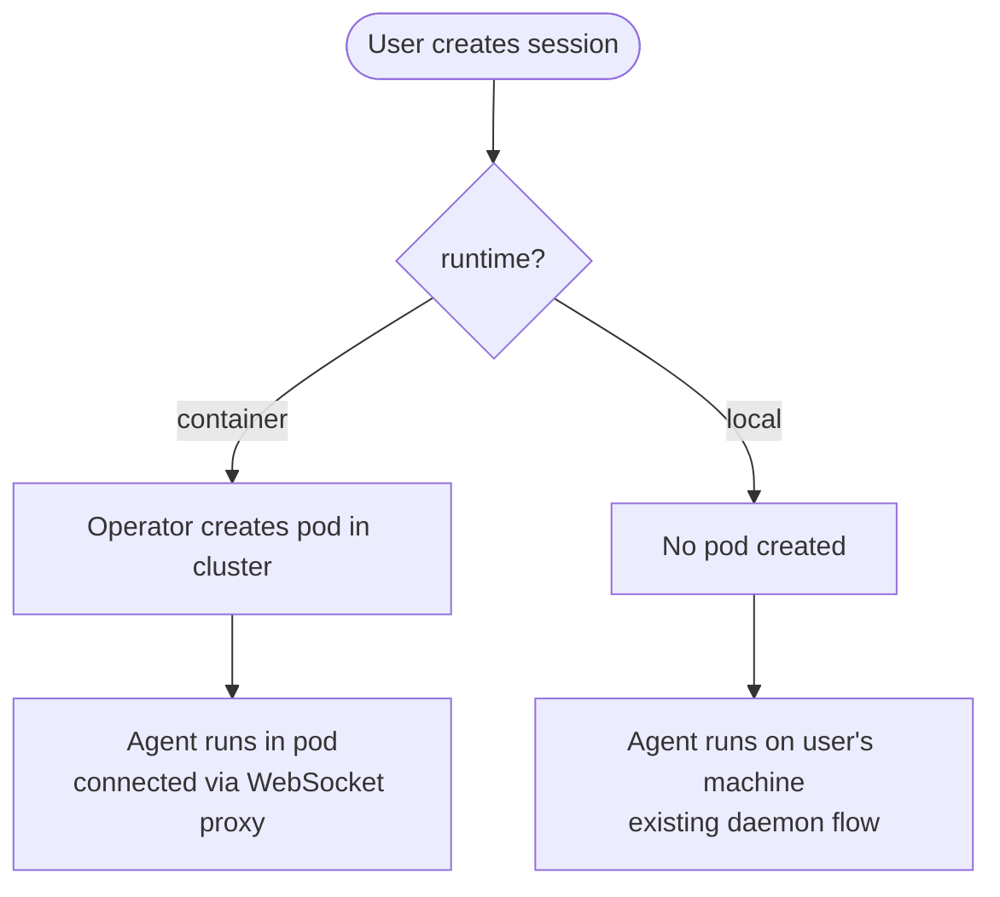
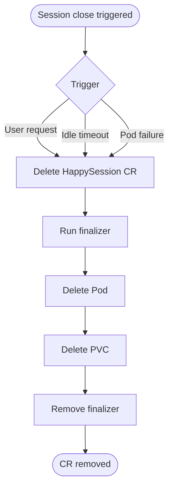

# K8s Operator Implementation Plan

This document outlines the plan to build a Kubernetes operator that manages containerized Happy sessions. The operator provides a long-running server that listens for user session requests, provisions per-session pods (including repository cloning), supports running in either a container or on the local machine, and tears down pods when sessions end.

## System overview



## Components

### 1. Custom Resource Definition (CRD): `HappySession`

Define a `HappySession` CRD to represent a user session inside the cluster.

```yaml
apiVersion: happy.engineering/v1alpha1
kind: HappySession
metadata:
  name: session-abc
spec:
  userId: "user-123"
  repository: "https://github.com/org/repo.git"
  branch: "main"
  runtime: "container"          # "container" | "local"
  image: "ghcr.io/happy/session-runtime:latest"
  resources:
    cpu: "1"
    memory: "2Gi"
  timeout: "4h"                 # auto-cleanup after idle timeout
status:
  phase: Running                # Pending | Cloning | Running | Terminated
  podName: session-abc-pod
  startedAt: "2026-02-07T20:00:00Z"
  message: ""
```

**Key fields:**
- `spec.runtime` — user chooses `container` (operator-managed pod) or `local` (operator only tracks the session, agent runs on the user's machine).
- `spec.repository` / `spec.branch` — git coordinates for the init-container clone step.
- `status.phase` — tracks lifecycle: `Pending → Cloning → Running → Terminated`.

### 2. Session Operator (Controller)

The operator is a long-running Deployment that watches `HappySession` resources and reconciles desired state.



**Reconciliation loop responsibilities:**
1. **Create** — When a new `HappySession` appears:
   - Validate the spec (repository URL, image, resources).
   - If `runtime: container`: create a Pod with an init container that clones the repository and a main container running the session agent.
   - If `runtime: local`: register the session in status only; no pod is created.
2. **Update** — Sync pod health/phase back into `HappySession.status`.
3. **Delete** — When the CR is removed: delete the associated pod and any persistent volume claims.

### 3. Session Pod Template

Each container-mode session gets a pod with the following structure:



**Init container (`git-clone`):**
- Lightweight image with `git`.
- Clones `spec.repository` at `spec.branch` into a shared `/workspace` volume.
- Supports authentication via a mounted Secret (SSH key or token).

**Main container (`session-runtime`):**
- Based on the project's existing `Dockerfile.server` or a dedicated runtime image.
- Runs the Happy agent/session process.
- Mounts `/workspace` as the working directory.
- Connects back to the Happy Server via Socket.IO for real-time session communication.

**Volume:**
- An `emptyDir` or PVC backed by the cluster's default `StorageClass`.
- Shared between init and main containers.

### 4. Long-Running Session Server

The operator includes an HTTP/WebSocket server (or extends the existing Happy Server) that exposes session lifecycle endpoints.



**Endpoints:**
| Method | Path | Description |
|--------|------|-------------|
| `POST` | `/sessions` | Create a new session (container or local) |
| `GET` | `/sessions` | List active sessions for the user |
| `GET` | `/sessions/:id` | Get session status |
| `WS` | `/sessions/:id/connect` | Stream session I/O |
| `DELETE` | `/sessions/:id` | Close and clean up the session |

### 5. Runtime Selection (Container vs Local)



- **Container mode:** The operator creates a pod; the user interacts with the session via the Session Server WebSocket proxy.
- **Local mode:** The operator only tracks session metadata. The session agent runs on the user's own machine using the existing CLI daemon flow. This reuses the current `packages/happy-cli` daemon architecture.

### 6. Session Cleanup

Sessions are cleaned up in three ways:

1. **Explicit close** — User calls `DELETE /sessions/:id`, which deletes the `HappySession` CR. The operator reconciles by deleting the pod and PVC.
2. **Idle timeout** — The operator monitors pod activity (heartbeats). If no activity is detected for the duration specified in `spec.timeout`, the operator deletes the CR automatically.
3. **Finalizers** — A finalizer on the `HappySession` CR ensures that the pod and volumes are fully cleaned up before the CR is removed from etcd.



## Implementation phases

### Phase 1: CRD and basic operator
- [ ] Define the `HappySession` CRD schema (`v1alpha1`).
- [ ] Scaffold the operator using Operator SDK or kubebuilder (Go) or Kopf (Python).
- [ ] Implement the reconciliation loop: create/delete pods based on `HappySession` CRs.
- [ ] Add init-container logic for repository cloning.
- [ ] Write unit tests for the reconciler with fake K8s clients.

### Phase 2: Session Server
- [ ] Build the HTTP + WebSocket session server (integrate with or extend the existing Happy Server in `packages/happy-server`).
- [ ] Implement `POST /sessions`, `GET /sessions`, `DELETE /sessions/:id`.
- [ ] Add WebSocket proxy to forward session I/O to the pod agent.
- [ ] Add authentication by reusing the existing Happy Server token system.

### Phase 3: Runtime selection
- [ ] Add `runtime: local` path — session metadata only, no pod creation.
- [ ] Integrate with the existing CLI daemon so that local sessions are discoverable via the session server.
- [ ] Add CLI flag or interactive prompt for the user to choose runtime mode.

### Phase 4: Cleanup and observability
- [ ] Implement idle-timeout reaper in the operator.
- [ ] Add finalizers for safe resource cleanup.
- [ ] Expose Prometheus metrics: active sessions, pod creation latency, cleanup counts.
- [ ] Add health checks and readiness probes for the operator deployment.

### Phase 5: Security and production readiness
- [ ] RBAC: scope operator ServiceAccount to only the resources it needs.
- [ ] Git auth: support SSH keys and tokens via Kubernetes Secrets for private repository cloning.
- [ ] Network policies: restrict pod-to-pod and pod-to-internet traffic.
- [ ] Resource quotas: enforce per-user session limits.
- [ ] Helm chart or Kustomize overlay for deployment.

## Technology choices

| Component | Recommended | Rationale |
|-----------|-------------|-----------|
| Operator framework | kubebuilder (Go) | Mature, well-documented, generates CRD manifests |
| Session runtime image | Extend `Dockerfile.server` | Reuse existing tooling and dependencies |
| Session server | Fastify + Socket.IO | Consistent with the existing Happy Server stack |
| Git clone init container | `alpine/git` | Minimal image, fast startup |
| Packaging | Helm chart | Standard K8s distribution format |

## Key implementation references
- Existing server: `packages/happy-server/sources/main.ts`
- Existing daemon: `packages/happy-cli/src/daemon`
- Kubernetes manifests: `packages/happy-server/deploy`
- Dockerfile: `Dockerfile.server`
